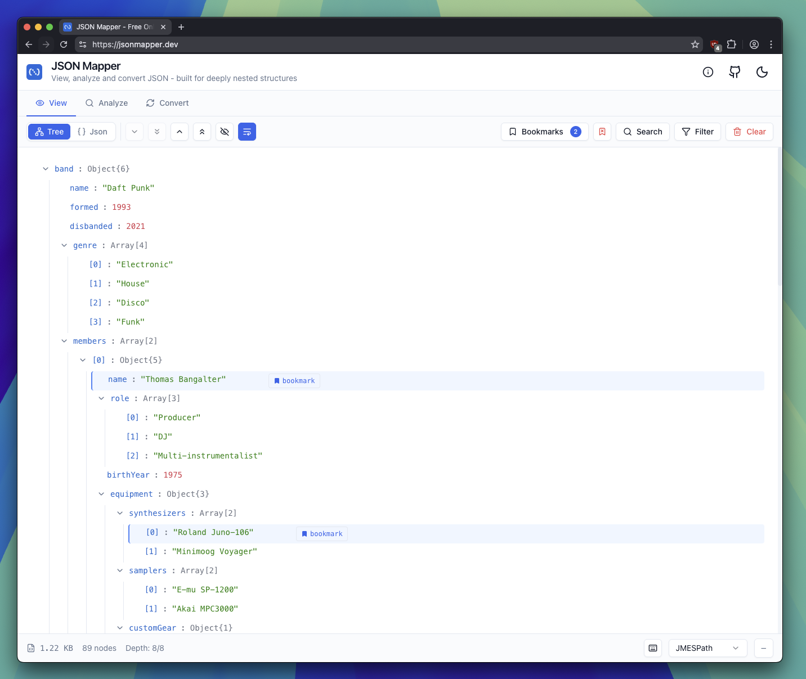

# JSON Mapper

A powerful JSON viewer and explorer for navigating, searching, and mapping nested JSON structures.

🌐 **[jsonmapper.dev](https://jsonmapper.dev)**



## Features

- 🌳 **Multiple Views** - Tree and JSON text views
- 🔍 **Smart Search & Filter** - Find and highlight content with case-sensitive options
- 🔖 **Bookmarks** - Save important paths with notes and transformations
- 📍 **Path Formats** - JMESPath, JSONPath, JavaScript, and Python syntax support
- 🔄 **Convert** - Export JSON to YAML, XML, CSV, and other formats
- ⚡ **Large File Support** - Virtual scrolling and lazy loading for huge files
- ⌨️ **Keyboard Shortcuts** - Full keyboard navigation support (press `⌘/` for help)
- 🎨 **Dark/Light Theme** - Beautiful UI with theme switching

## Quick Start

```bash
npm install
npm run dev
```

## Tech Stack

React • TypeScript • Vite • Tailwind CSS • Zustand • shadcn/ui

## Usage

1. Upload a JSON file, paste from clipboard, or try the example
2. Navigate using Tree or JSON view
3. Search and filter content
4. Copy paths in your preferred format
5. Bookmark important paths for reference
6. Export to various formats

## License

MIT
